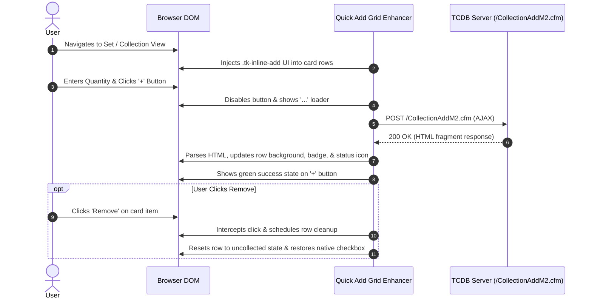
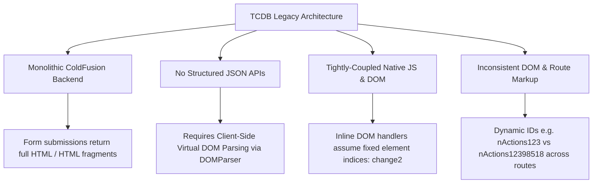
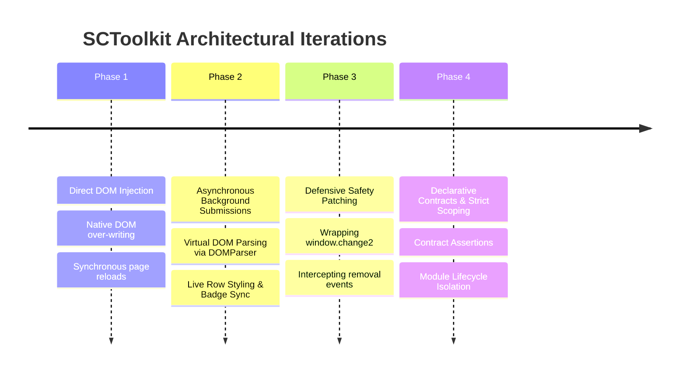
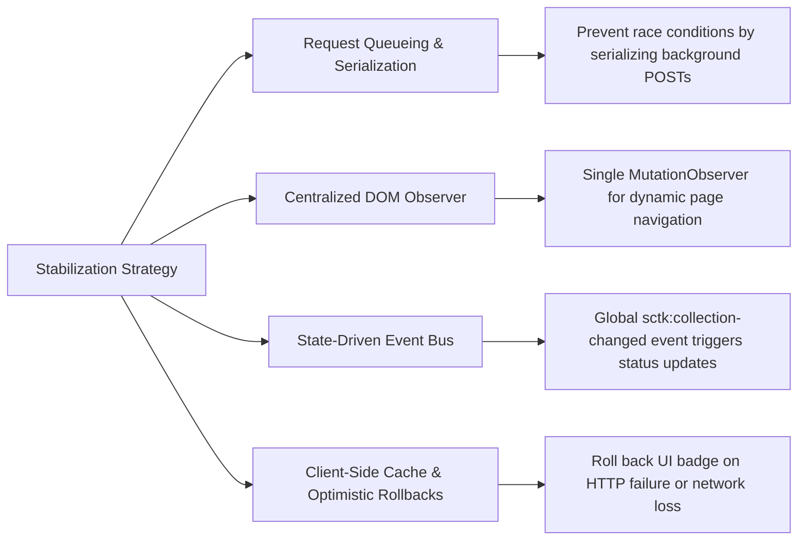

# Business Requirements Document (BRD) & Use Case Specification: Quick Add Grid Enhancer

---

## 1. Executive Summary & Feature Overview

### 1.1 Objective
The **Quick Add Grid Enhancer** upgrades card set listings (Collection, Wantlist, and For Sale/Trade views) on TCDB (Trading Card Database) by embedding an inline, background-submitted quantity selector directly into each row. 

### 1.2 Problem Statement
Natively, adding items to a collection on TCDB requires users to navigate away from the current page, complete multi-step dropdown forms, or check checkboxes followed by page reloads. This creates friction when processing large sets or managing multiple items across different collection lists.

### 1.3 Solution & Value Proposition
- **Zero-Page-Reload Additions:** Users enter a quantity and click `+` to asynchronously add items in the background via asynchronous `POST` requests to `/CollectionAddM2.cfm`.
- **Context-Aware Dynamic List Routing:** Automatically detects whether the user is on a **Collection (`G`)**, **Wantlist (`W`)**, or **For Sale/Trade (`S`)** page and routes the item accordingly.
- **Real-Time DOM & UI State Synchronization:** Instantaneously updates row background colors, column status icons, quantity badges, and context menu actions from the server response without requiring a full page refresh.
- **Smart Removal Cleanup:** Intercepts item removal events to decrement quantity badges or seamlessly reset rows to their uncollected state.
- **Strict Module Control:** Adheres to global extension feature toggles, ensuring zero event-listener leakage or side-effects when disabled.

---

## 2. Business Requirements (BRs)

### 2.1 Functional Requirements

| Requirement ID | Requirement Name | Description |
| :--- | :--- | :--- |
| **BR-FUNC-01** | **Inline UI Injection** | The system shall inject an inline quantity input (`<input type="number">`) and an add button (`<button>+</button>`) into column 4 (or the designated action cell) of each valid card row. |
| **BR-FUNC-02** | **Context & Sport Resolution** | The system shall derive the `AddTo` list context (`G` = Collection, `W` = Wantlist, `S` = For Sale/Trade), `SetID`, and `SportType` from the active URL, search parameters, or page breadcrumbs. |
| **BR-FUNC-03** | **Asynchronous Add Submission** | Clicking the inline `+` button shall construct a valid `URLSearchParams` payload and issue an asynchronous `POST` request to `/CollectionAddM2.cfm` with `X-Requested-With: XMLHttpRequest`. |
| **BR-FUNC-04** | **Server DOM Sync & Feedback** | Upon receiving a successful HTTP `200 OK` response, the system shall parse the response HTML and sync the live row's background styling (`bgcolor`/`class`), quantity badge (Column 1), status icon (Column 4), and context dropdown menu (`div[id^="nActions"]`). |
| **BR-FUNC-05** | **Optimistic Visual State Toggle** | When a card transitions from uncollected to collected, the native checkbox label shall hide, and the inline Quick Add control shall remain visible for additional item entries. |
| **BR-FUNC-06** | **Live Removal Handling** | The system shall monitor item removal triggers (`CollectionRemove.cfm`, `RemoveQ`). On removal, if quantity exceeds 1, decrement the badge; if quantity equals 1, reset row styling, restore native checkboxes, and trigger collection counter recalculation. |
| **BR-FUNC-07** | **Native Error Suppression** | The system shall safely wrap TCDB's native JavaScript `window.change2()` function to suppress unhandled `TypeError` exceptions when native checkboxes are absent or hidden. |
| **BR-FUNC-08** | **Strict Feature Scoping** | Global event listeners (e.g., removal click interception) shall ONLY be attached when the module is explicitly enabled and initialized by the framework. |

### 2.2 Non-Functional & Safety Requirements
- **Performance:** Asynchronous requests must not block UI interactivity. Button feedback (`...` loading indicator, success green flash, error red flash) must provide immediate visual confirmation.
- **Idempotency:** Re-running DOM initialization (e.g., pagination or dynamic row inserts) must not inject duplicate controls onto previously enhanced rows (`data-quick-add-injected="true"`).
- **Session Protection:** If the server returns a login redirect or error page, the system must abort DOM mutation and display an error indicator (`!`).

---

## 3. Detailed Use Cases

---

### Use Case UC-1: Inline Card Quick Add Submission

* **Primary Actor:** Registered User / Collector
* **Pre-conditions:**
  1. User is logged into TCDB.
  2. Quick Add Grid Enhancer module is enabled.
  3. User is viewing a card set page (Collection, Wantlist, or For Sale/Trade).
* **Post-conditions:** Card item is added to the user's selected list on the server, and the UI reflects updated quantity, background styling, and status indicators.
* **Trigger:** User clicks the inline `+` button on a card row.

#### Main Success Scenario:
1. User enters a quantity (default: `1`) into the inline quantity box `.tk-qty-input`.
2. User clicks the `+` button `.tk-add-btn`.
3. System disables the button and updates text to `...` to indicate loading.
4. System constructs the request payload using current `CardID`, `SetID`, `AddTo` context (`G`/`W`/`S`), `SportType`, and pagination/filter parameters.
5. System executes an asynchronous `POST` to `/CollectionAddM2.cfm`.
6. Server responds with HTTP `200 OK` carrying updated row HTML.
7. System parses the virtual DOM, locates the matching card row, and updates:
   - Row background color / CSS class (`table-success`, `#d4edda`, etc.).
   - Column 1 quantity badge (`X`).
   - Column 4 status icon (Box for Collection, Handshake for Trade, Heart for Wantlist).
   - Context dropdown menu ID and items (`div[id^="nActions"]`).
8. System flashes green success feedback on the `+` button for 1.2 seconds before re-enabling it.

#### Extensions / Exception Flows:
- **3a. Server returns HTTP Error or Login Redirect:**
  1. System catches exception/error HTML.
  2. Button text changes to `!` and applies `.tk-add-btn-error` styling for 2 seconds.
  3. System logs error diagnostic and leaves existing row state intact.

---

### Use Case UC-2: Live Item Removal & Status Reset

* **Primary Actor:** Registered User / Collector
* **Pre-conditions:**
  1. User is viewing a page with collected card rows.
  2. Quick Add Grid Enhancer module is active.
* **Post-conditions:** Item is removed on the server, and row styling/controls reset to uncollected state.
* **Trigger:** User clicks a "Remove" link (`CollectionRemove`, `RemoveQ`) on a card row context menu.

#### Main Success Scenario:
1. User clicks "Remove" on a card row.
2. Global remove click listener detects the action and extracts the target `CardID`.
3. System schedules row cleanup after 300ms.
4. System inspects Column 1 quantity badge:
   - **If Quantity > 1:** System decrements badge text by 1.
   - **If Quantity = 1:** System resets row styling:
     - Removes `bgcolor` and resets CSS class to `.collection_row`.
     - Clears Column 1 quantity badge.
     - Restores native checkbox in Column 4.
     - Hides custom `.tk-inline-add` UI.
     - Triggers `Collection Quantity Counter` recalculation event (`sctk:collection-changed`).

---

### Use Case UC-3: Module Disablement & Zero Side-Effects

* **Primary Actor:** User / System Administrator
* **Pre-conditions:** Quick Add Grid Enhancer module is set to **Disabled** in Settings.
* **Post-conditions:** System operates strictly using native TCDB markup with zero injected elements or background event listeners.

#### Main Success Scenario:
1. User navigates to a set listing page.
2. Framework evaluates active module definitions (`resolveModules`).
3. Because `quickAddGridEnhancer` is disabled:
   - `initQuickAddGridEnhancer()` is **not** called.
   - `setupRemoveListener()` is **not** executed.
4. Native TCDB checkboxes and tables render unmodified.
5. Clicking native "Remove" links performs standard TCDB page reloads without triggering Quick Add logs or background DOM resets.

---

## 4. Test Cases & Acceptance Criteria (TCs)

### Group A: Context Resolution & Payload Construction

| Test Case ID | Test Description | Input / Setup | Expected Outcome | Pass/Fail Criteria |
| :--- | :--- | :--- | :--- | :--- |
| **TC-QA-001** | Detect List Context from Path | Path: `/ViewCollectionWantlist.cfm/sid/100` | Context returns `'W'` (Wantlist). | Function `getListContext()` returns `'W'`. |
| **TC-QA-002** | Detect For Sale/Trade Context | Path: `/ViewCollectionForSaleTrade.cfm/sid/100` | Context returns `'S'` (Sale/Trade). | Function `getListContext()` returns `'S'`. |
| **TC-QA-003** | Detect SetID from Path | Path: `/ViewCollection.cfm/sid/54321` | SetID returns `'54321'`. | Function `getContextSetId()` returns `'54321'`. |
| **TC-QA-004** | Form Payload Structure | `CardID=101`, `Qty=2`, `AddTo=G`, `SetID=100`, `Sport=Baseball` | `URLSearchParams` payload contains `CardID=101&Quantity=2&AddTo=G&SetID=100&Type=Baseball`. | All payload fields strictly match expected key-value pairs. |

---

### Group B: UI Injection & Control Synchronization

| Test Case ID | Test Description | Input / Setup | Expected Outcome | Pass/Fail Criteria |
| :--- | :--- | :--- | :--- | :--- |
| **TC-QA-005** | UI Injection on Valid Card Row | Table row containing `a[href*="/cid/12345"]` | `.tk-inline-add` container injected into Column 4 with number input and `+` button. | `.tk-inline-add` exists; input value defaults to `1`. |
| **TC-QA-006** | Idempotent Re-injection Skip | Row already carrying `data-quick-add-injected="true"` | `injectRowQuickAdd()` returns `false` without duplicate DOM insertion. | Exactly 1 `.tk-inline-add` container present per row. |
| **TC-QA-007** | Visibility Sync (Uncollected Card) | Row with no badge and unchecked native checkbox | Custom UI hidden (`display: none`), native checkbox visible (`display: ''`). | `syncRowControlVisibility()` sets custom UI to `none`. |
| **TC-QA-008** | Visibility Sync (Collected Card) | Row with `table-success` class or quantity badge | Custom UI visible (`display: inline-flex`), native checkbox hidden. | Native checkbox label set to `display: none`. |

---

### Group C: Asynchronous Submission & Server Response Sync

| Test Case ID | Test Description | Input / Setup | Expected Outcome | Pass/Fail Criteria |
| :--- | :--- | :--- | :--- | :--- |
| **TC-QA-009** | Successful Async Add (200 OK) | User clicks `+` on Card `55555`; Server returns row HTML with `#d4edda` | Button shows `...`, sends POST, updates row `bgcolor` to `#d4edda`, injects badge `1`, updates dropdown ID, flashes green success. | Row background, badge, and context menu update cleanly without page reload. |
| **TC-QA-010** | Error Handling on Server Failure | Server returns 500 status code or login HTML redirect | Button displays `!`, flashes red error styling for 2s, row remains unmodified. | Catch block logs error; UI returns to initial state. |

---

### Group D: Removal Interception & Module Scoping

| Test Case ID | Test Description | Input / Setup | Expected Outcome | Pass/Fail Criteria |
| :--- | :--- | :--- | :--- | :--- |
| **TC-QA-011** | Remove Click Decrements Badge (Qty > 1) | Row has quantity badge `3`; User clicks "Remove" | Badge text decrements to `2`; row remains collected. | Badge text equals `2`. |
| **TC-QA-012** | Remove Click Resets Row (Qty = 1) | Row has quantity badge `1`; User clicks "Remove" | Row background cleared, badge removed, native checkbox restored, custom UI hidden, counter event dispatched. | Row class equals `collection_row`; badge removed. |
| **TC-QA-013** | Listener Isolation when Disabled | Module is disabled; User clicks native "Remove" link | `_sctkRemoveListenerWired` remains `undefined`; no Quick Add logs or background DOM mutations occur. | Click handler does not execute when module is uninitialized. |
| **TC-QA-014** | `window.change2` Safety Patch | Native checkbox absent; `window.change2()` invoked | Error caught and suppressed without uncaught TypeError in console. | Execution completes cleanly without throwing. |

# Technical Addendum: TCDB Architectural Challenges, Iterative Solutions, Known Gaps, & Stabilization Strategy

---

## 5. Technical Challenges Stemming from TCDB's Architecture

The Trading Card Database (TCDB) presents a unique set of engineering challenges for client-side enhancement due to its legacy stack and server-side rendering paradigm:

### 5.1 Monolithic ColdFusion SSR & Lack of JSON APIs
- **HTML Fragment Payload Parsing:** TCDB endpoints (e.g., `/CollectionAddM2.cfm`) do not expose REST/JSON services. Every operation returns full HTML pages or HTML fragments. To sync client state without full reloads, SCToolkit must asynchronously `POST` `URLSearchParams` form data, parse the raw HTML response via `DOMParser()`, extract the target row, and diff updated nodes against the live DOM.
- **Complex Query & Session State:** Submissions depend on transient page state (`sReferer`, `PageIndex`, `Filter`, `sTeamID`, `ColType`, `BasicID`, `MultiID`), requiring payload builders to scrape active query strings and breadcrumbs dynamically.

### 5.2 Rigid Native JavaScript & Brittle DOM Dependencies
- **Position-Dependent Native Scripts:** TCDB utilizes legacy inline JavaScript (such as `window.change2(obj)`) that hardcodes rigid DOM traversals (e.g., `tr.childNodes[7].childNodes[0].childNodes[0].checked = false;`).
- **DOM Mutation Crashes:** When SCToolkit hides native checkboxes or restructures cell contents, native scripts throw uncaught `TypeError` exceptions that disrupt the user experience if left unhandled.

### 5.3 Non-Standardized & Non-Semantic Markup
- **Missing Data Attributes:** Native table rows lack semantic identifiers like `data-card-id` or `data-set-id`. IDs must be extracted via regular expressions on anchor `href` strings (`/cid/(\d+)`, `/sid/(\d+)`).
- **Dynamic Element Identifiers:** Context menu wrappers use server-generated dynamic IDs (e.g., transitioning from `nActions123` to `nActions12398518` upon adding an item). Modifying one cell without syncing dynamic container IDs breaks subsequent native action triggers.
- **Inconsistent Route Layouts:** Markup differs significantly across `ViewCollection.cfm`, `ViewCollectionWantlist.cfm`, `ViewCollectionForSaleTrade.cfm`, and subset views, requiring robust fallback selectors.

---

## 6. Where We Have Iterated (Architectural Evolution)

Over multiple iterations, SCToolkit's architecture has evolved from basic DOM manipulation to a resilient, contract-driven client application:

### 6.1 Virtual DOM Parsing & Targeted Cell Syncing
* **Old Approach:** Overwriting table cells or triggering full page reloads after additions.
* **Iterated Solution:** Implemented `updateRowFromBackground()` which parses response HTML using `DOMParser()`, selectively extracts updated row classes, inline background colors (`bgcolor`), hover handlers (`onmouseout`/`onmouseover`), Column 1 quantity badges, Column 4 status icons, and replaces context menu containers (`div[id^="nActions"]`) while preserving injected SCToolkit UI controls.

### 6.2 Protective Safety Patching (`patchNativeChange2`)
* **Old Approach:** Allowing native TCDB scripts to execute directly against altered DOM trees, leading to standard JavaScript runtime crashes.
* **Iterated Solution:** Introduced `patchNativeChange2()`, which wraps `window.change2` in a defensive `try/catch` wrapper. This suppresses unhandled `TypeError` exceptions when native checkboxes are missing or hidden, logging diagnostic warnings without interrupting user workflows.

### 6.3 Module Scoping & Side-Effect Isolation
* **Old Approach:** Registering global event listeners (e.g., `document.addEventListener('click')` for item removal) at top-level module load time, causing event handlers to execute even when modules were toggled off in settings.
* **Iterated Solution:** Refactored event listener attachment into explicit setup routines (`setupRemoveListener()`) that execute **only** during module `init()` when contract checks pass and module configuration is active.

### 6.4 Declarative Contract Assertions
* **Old Approach:** Assuming selector existence, causing silent failures or null pointer exceptions when TCDB updated markup.
* **Iterated Solution:** Integrated `assertContract()` across module entry points, validating required DOM selectors before module execution and reporting structural drift to diagnostics.

---

## 7. Where Gaps & Vulnerabilities Remain

Despite significant stabilization, architectural constraints in TCDB still leave specific operational gaps:

### 7.1 Multi-Tab & Concurrent State Drift
- **Issue:** If a user modifies their collection in another tab (or on a mobile device), the current page's DOM state becomes stale.
- **Impact:** Quick Add payload construction relies on page-load query params (`PageIndex`, `Filter`). Submitting additions against stale page parameters can misattribute collection list entries or duplicate records.

### 7.2 Race Conditions during Rapid Add Clicks
- **Issue:** While individual button clicks disable the `+` control during inflight requests (`...`), rapid sequential additions across *different* card rows send parallel asynchronous `POST` requests to ColdFusion.
- **Impact:** ColdFusion session/database locks or out-of-order response resolutions can result in transient quantity mismatch between Column 1 badges and server totals until the page is refreshed.

### 7.3 Multi-Item / Complex Action Sync Gaps
- **Issue:** Native TCDB action dropdowns contain multi-step modals (e.g., "Add Serial Numbered / Autograph Details", "Move to Custom Folder").
- **Impact:** Quick Add handles simple single/multiple quantity increments cleanly, but complex metadata additions performed via native modals bypass Quick Add's background DOM parser, requiring a manual page refresh to update inline badges.

### 7.4 Brittle Regex ID Scrape Fallbacks
- **Issue:** If TCDB updates internal URL routing patterns (e.g., changing `/cid/12345` to `/card/12345`), regex extractors across `quickAddGridEnhancer`, `setListEnhancer`, and `cardNameFormatter` will fail.

---

## 8. Strategy for Further Stabilization

To move Quick Add and the broader SCToolkit platform toward enterprise-grade stability, the following architectural enhancements are recommended:

### 8.1 Serialized Request Queue Engine
- **Recommendation:** Implement a central async request queue for Quick Add submissions.
- **Mechanism:** Instead of firing unthrottled `fetch()` calls on every `+` click, push payloads into a FIFO (First-In, First-Out) queue. Process requests sequentially with standard retries to prevent database lock contention on TCDB's ColdFusion backend and eliminate response race conditions.

### 8.2 Optimistic UI Updates with Automatic Rollback
- **Recommendation:** Immediately update quantity badges and row styling upon `+` click before server response returns, rather than waiting for HTTP resolution.
- **Mechanism:** Store a snapshot of the row's previous state. If the server request succeeds, confirm the change; if it fails (network loss, timeout, session expiry), automatically revert the row state and alert the user via toast notification.

### 8.3 Unified MutationObserver & Centralized Bus
- **Recommendation:** Replace fragmented event listeners across modules with a single, centralized `MutationObserver` instance attached to `#main-content-area`.
- **Mechanism:** Broadcast standardized custom DOM events (`sctk:collection-updated`, `sctk:row-mutated`) across a central event bus so modules (Quantity Counter, Card Name Formatter, Quick Add Grid) synchronize seamlessly without tight coupling.

### 8.4 Self-Healing DOM Selector Registries
- **Recommendation:** Extend the `SELECTOR_REGISTRY` with multi-tier fallback selectors for every critical element (card links, status cells, quantity badges).
- **Mechanism:** If primary selector `a[href*="/cid/"]` fails, automatically attempt fallback selectors (`a[href*="cid="]`, `tr[data-cardid]`) and log a telemetry contract diagnostic to notify developers of TCDB markup changes before features break.